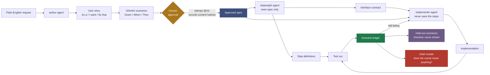
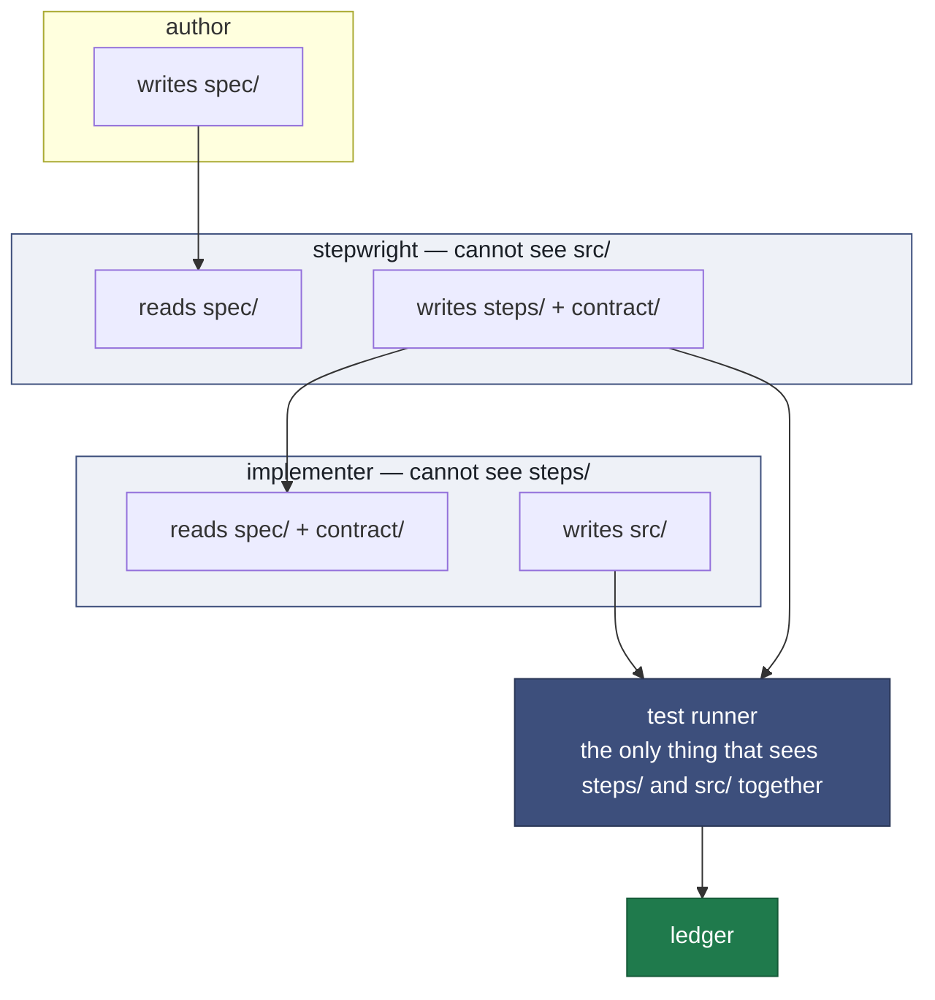
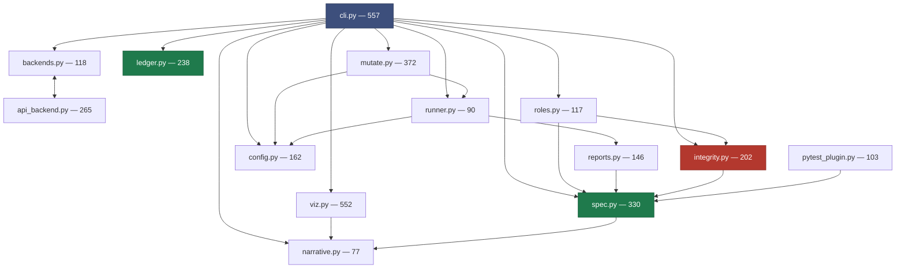
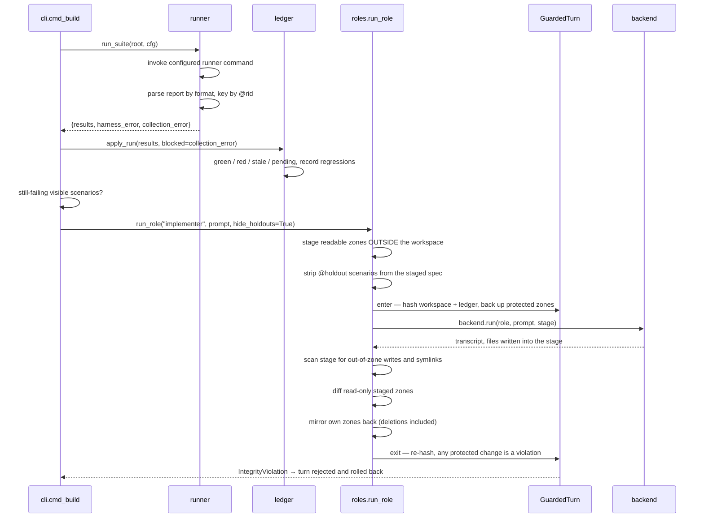

# Architecture

## The problem

An agent that writes the specification, the tests, and the implementation can always make the
suite pass. A green suite then proves internal consistency, not correctness — self-graded
homework. Every mechanism in `shalt` exists to take some part of that capability away
structurally, rather than asking for it politely in a prompt.

Three distinct failure modes, which need three distinct defences:

| failure | what it looks like | defence |
|---|---|---|
| **tampering** | the implementer edits or weakens the tests | zones + write guard ([isolation.md](isolation.md)) |
| **overfitting** | the implementer special-cases the examples it was shown | holdout scenarios ([hierarchy.md](hierarchy.md)) |
| **weak oracle** | the stepwright writes assertions that do not check anything | mutation testing ([mutation.md](mutation.md)) |

A fourth failure is not an agent's fault at all but is just as damaging: **drift**, where the
spec changes and the suite keeps passing because nobody re-checked. That one is handled by
binding status to a content hash ([identity.md](identity.md)).

## Core concepts

| term | meaning |
|---|---|
| **zone** | a directory writable by exactly one role: `spec/`, `steps/`, `contract/`, `src/` |
| **role** | one agent job: `author`, `stepwright`, `implementer` |
| **rid** | a durable scenario id (`@rid:S-b291b8fd`) stamped into the feature file at approval |
| **canonical hash** | a hash of everything that changes a scenario's meaning, and nothing that doesn't |
| **spec lock** | the record of who approved which scenario contents, and when |
| **ledger** | `.shalt/ledger.json` — the durable record of every scenario's status |
| **upheld** | a bound test passes, against the current meaning of the scenario |
| **holdout** | an approved scenario never shown to the implementer, used to detect overfitting |
| **oracle** | the step definitions: the thing that decides whether behaviour is correct |
| **blind spot** | a surviving mutation in a file a passing scenario provably executes |

## The pipeline



The human gate sits at the Gherkin, deliberately. Gherkin's real virtue is not that it is
executable — it is that it is **cheap for a non-engineer to read**. That makes it the only place
in the pipeline where human review is both meaningful and affordable.

## Zones and roles

Five zones, each with exactly one writer (human may write all):

| zone | written by | read by | contains |
|---|---|---|---|
| `spec/` | author | everyone | Feature files and user stories |
| `mockups/` | **designer** | designer, implementer, human | HTML storyboards (sketched until green) |
| `steps/` | **stepwright** | the test runner | executable step definitions — the oracle |
| `contract/` | **stepwright** | implementer | the API surface the steps will call |
| `src/` | implementer | implementer, test runner | the implementation |

Read access is narrower than write access, and that asymmetry is the point:



The implementer receives the spec, the interface contract the stepwright declared, and the
failing test output — but never the step definitions themselves. It therefore has to implement
the *behaviour* rather than the *assertions*. The `contract/` zone exists precisely so that
withholding `steps/` does not also withhold the API surface the implementer legitimately needs.

## Module map

3,335 lines across 15 modules. Dependencies flow strictly downward — no cycles except the
deliberate lazy import between `backends` and `api_backend`.



| module | responsibility |
|---|---|
| `spec.py` | Gherkin parsing, scenario identity, canonical hashing, holdout stripping |
| `narrative.py` | user-story grammar (`As a / I want / So that`) |
| `ledger.py` | the scenario ledger, its status rules and its invariants |
| `integrity.py` | zones, read/write maps, write guards, rollback, the standing audit |
| `roles.py` | staged, guarded turns — the isolation mechanism |
| `config.py` | `shalt.toml`, runner presets: what makes the tool language-agnostic |
| `reports.py` | Cucumber JSON and Cucumber Messages parsers, bound by `@rid` tag |
| `runner.py` | invokes the configured runner, folds results back |
| `pytest_plugin.py` | native Python binding: pytest-bdd outcomes → rids |
| `backends.py` | the `Backend` protocol; fixture and `claude -p` adapters |
| `api_backend.py` | OpenAI-compatible adapter (Grok, OpenAI) with a scoped tool loop |
| `mutate.py` | mutation testing the oracle |
| `viz.py` | the tree, Mermaid diagrams, the HTML dashboard |
| `cli.py` | command surface |

## Workspace layout

```
myproject/
  shalt.toml              runner command and report format
  spec/                   Gherkin + user stories        (author writes)
    billing/
      invoice.feature
  steps/                  step definitions              (stepwright writes)
  contract/
    interface.md          the API surface the steps call (stepwright writes)
  src/                    implementation                (implementer writes)
  .shalt/
    ledger.json           the durable record
    last_run.json         most recent run report (transient)
  docs/
    dashboard.html        generated by `shalt dashboard`
    diagrams/*.mmd        generated by `shalt diagrams`
```

`.shalt/stage/` and `.shalt/backup/` are transient and git-ignored. `.shalt/ledger.json` is
the artifact worth committing: it is the record of what was approved and what has been upheld.

## Data flow for one build turn



The loop terminates on all-visible-upheld, or on `--max-turns`. Then a **final verification run
includes the holdouts**: if every visible scenario is upheld and a held-out one is not, that is
reported as overfitting.
