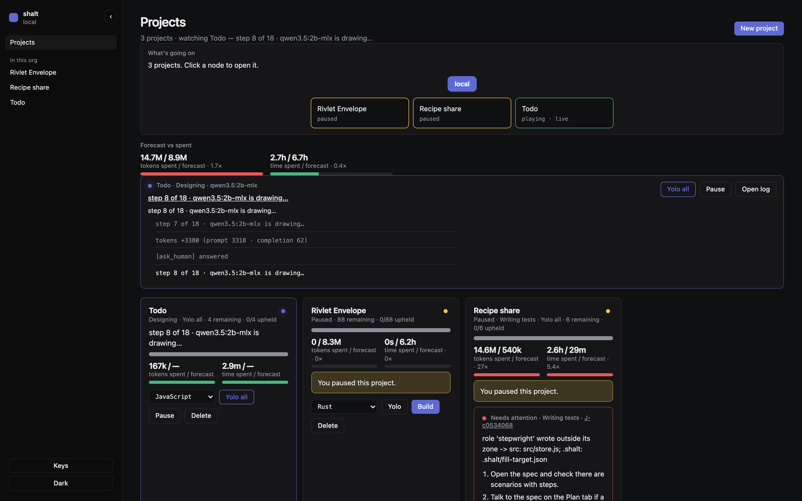
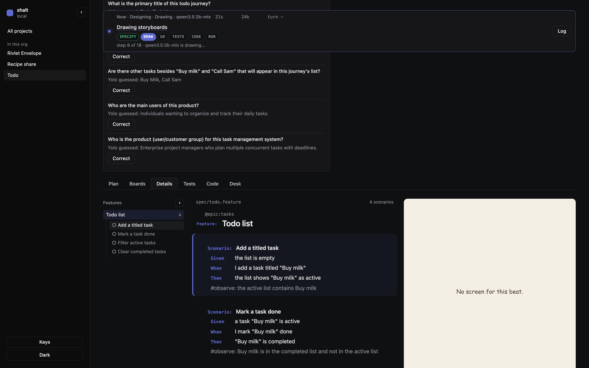
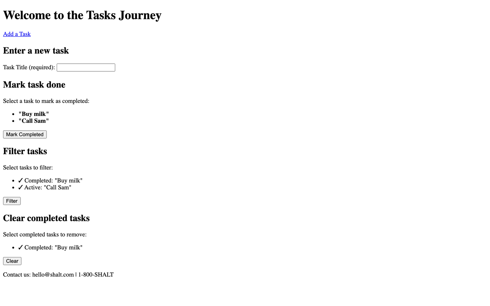

# Bench: todo — 26 Sep 2026

Local Play, yolo all, javascript. Envelope paused. Recipe share paused.

Interview: add a titled task, mark done, filter active vs completed, clear completed. Session only.

## Result (this slice)

| | |
|---|---|
| Author | 2B → 4B → 8B in **112s**. All three dumped. Error: `spec has no Scenario: lines`. |
| Play after that | 0 workers (last-writer Stop). Loop bug. |
| Seed | `todo.feature` 4 scenarios + `#observe:` from the interview keywords. |
| After seed | Design on `qwen3.5:2b-mlx`. Wrote `mockups/journeys/tasks/tasks.html` then **rewrote the same 3 files** on later design jobs. |
| Greens | 0/4. No tests yet. |
| Then lint | n/a (no step bodies). |

## What lined up

- Hop 2B → 4B → 8B actually fired.
- Seed + `#observe:` shows in Details (Buy milk / Call Sam).
- Isolation still holds on Recipe share (stepwright `src/` write refused) — visible on the same inbox shot.

## What did not

- 8B still cannot write Feature/Scenario from a todo interview without a seed.
- Design 2B loops the same HTML; `design_needed` does not go false.
- Todo mockup screenshot is a 2B dump (inline CSS, Times-looking type, `hello@shalt.com`). Not the sketch kit.

## Shots

Machine log: `2026-09-26-todo.jsonl`.
