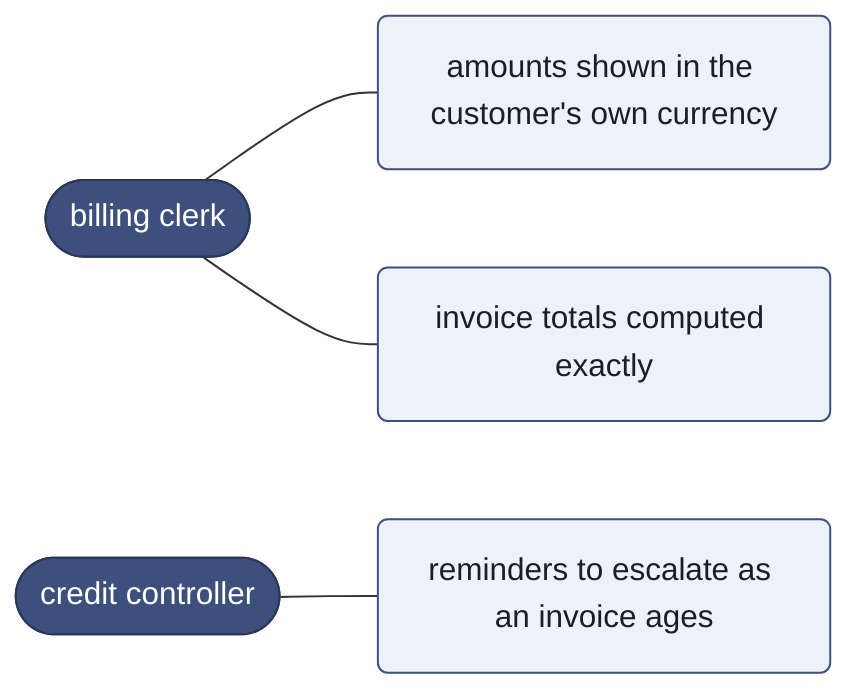

# Use Cases

```mermaid
graph LR
  A_billing-clerk(["billing clerk"])
  A_billing-clerk --- U_amounts-shown-in-the-customer-s-own-curr
  A_billing-clerk --- U_invoice-totals-computed-exactly
  A_credit-controller(["credit controller"])
  A_credit-controller --- U_reminders-to-escalate-as-an-invoice-ages

  U_amounts-shown-in-the-customer-s-own-curr("amounts shown in the customer's own currency")
  U_invoice-totals-computed-exactly("invoice totals computed exactly")
  U_reminders-to-escalate-as-an-invoice-ages("reminders to escalate as an invoice ages")

  style A_billing-clerk fill:#3d4f7c,stroke:#2a3757,color:#ffffff
  style A_credit-controller fill:#3d4f7c,stroke:#2a3757,color:#ffffff
  style U_amounts-shown-in-the-customer-s-own-curr fill:#eef1f7,stroke:#3d4f7c,color:#1a1f26
  style U_invoice-totals-computed-exactly fill:#eef1f7,stroke:#3d4f7c,color:#1a1f26
  style U_reminders-to-escalate-as-an-invoice-ages fill:#eef1f7,stroke:#3d4f7c,color:#1a1f26
```
