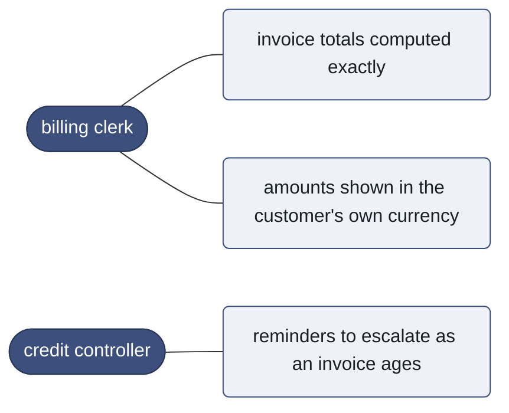

# Hierarchy, user stories and derived diagrams

## The breakdown is three levels, all expressed in Gherkin

Nothing lives in a sidecar file. The project-management structure is a reading of the spec.

| level | source |
|---|---|
| **epic** | an `@epic:` tag on the feature, else the first directory under `spec/` |
| **story** | the feature, plus the `As a / I want / So that` narrative in its description block |
| **task** | one scenario |

```gherkin
@epic:billing
Feature: Invoice totals

  As a billing clerk
  I want invoice totals computed exactly
  So that customers are never billed the wrong amount

  @rid:S-b291b8fd
  Scenario: An invoice with a single line item
    ...
```

Feature-level tags inherit to every scenario, per the Gherkin specification, which is how one
`@epic:` tag reaches each scenario without repetition. `Scenario.all_tags` returns own tags plus
inherited; `Scenario.epic` checks that combined set. Directory fallback means
`spec/payments/checkout.feature` belongs to epic `payments` with no tag at all.
→ `test_epic_comes_from_the_feature_tag_and_is_inherited_by_scenarios`,
`test_epic_falls_back_to_the_directory_under_spec`

## User-story grammar

`narrative.py` parses each clause independently rather than matching one large pattern, so the
usual orderings all work:

```
As a X / I want Y / So that Z
As a X / In order to Z / I want Y
In order to Z / As a X / I want Y
```

Accepted openers: `As a|an|the`; `I want|need|would like|can|do` (optionally `to`);
`So that|In order to`. Parsing is tolerant — a description that is not a user story yields an
empty `Story` rather than an error, and `Story.missing` names which clauses are absent so
`shalt stories` can report them.
→ `test_story_clause_orderings`,
`test_prose_that_is_not_a_story_yields_nothing_and_says_what_is_missing`

## The use case diagram is derived, not drawn

**"As a &lt;actor&gt;, I want &lt;capability&gt;" already contains a use case diagram.** The
actor is the actor, the capability is the use case, and their appearance in one story is the
association between them. So there is no second artefact to author and nothing that can drift
out of sync with the spec.



Mermaid has no UML use-case type, so actors are stadium nodes and use cases rounded ones — which
is how a use case diagram reads anyway. Labels are quoted and stripped of characters that break
the parser, so a scenario named `A "quoted" name` cannot produce an unrenderable diagram.
→ `test_diagrams_survive_labels_with_quotes_and_newlines`

Each actor/capability pair appears **once**, not once per scenario.
→ `test_actors_map_to_the_capabilities_they_want`

## Roll-up

A parent's status is the worst of its children. `green` requires every child green; the
precedence is `red` > `stale` > `pending` > `green`. An empty parent is `pending`, never green.

A rolled-up status must never be more optimistic than what it contains — one failing scenario
sinks its story and its epic.
→ `test_a_parent_is_never_greener_than_its_children`, `test_rolled_up_status_is_not_optimistic_in_the_tree`

## Holdouts

A scenario tagged `@holdout` is approved, is checked during verification, and is **never staged
for the implementer**:

- `spec.strip_holdouts` removes the scenario's line range — computed from the parser, not by
  matching text — from the staged copy of the spec;
- `runner.failure_digest` is filtered to visible rids so a held-out scenario's expected value
  cannot leak through failure output;
- `cli.cmd_build` excludes holdouts from the loop's target set, then runs a final verification
  **including** them.

If every visible scenario is upheld and a held-out one is not, that is reported as overfitting:
the implementation satisfies the examples it saw rather than the behaviour.

Tag matching is **exact**. An earlier version used a substring test, so `@holdout_wip` was
stripped from the implementer's view but not tracked as a holdout — the build loop then demanded
a scenario go green while never showing it, burning every turn.
→ `test_holdout_tag_matching_is_exact`

Line ranges come from the parser because a docstring containing `@something` or `Scenario:` at
low indentation used to cut the deletion short and leak part of the held-out scenario —
including its expected value — into the implementer's staged spec.
→ `test_holdout_containing_a_docstring_does_not_leak`

## Generated outputs

`shalt diagrams` writes to `docs/diagrams/`, as both `.mmd` and `.md` wrappers so they render in
GitHub, in pull requests and in most editors:

| file | content |
|---|---|
| `use-cases` | actors and the capabilities they want |
| `breakdown` | epic → story → scenario, coloured by status |
| `pipeline` | the pipeline, and who may touch what |

`shalt dashboard` writes `docs/dashboard.html`: one self-contained file, no network and no build
step. It shows the progress meter, the derived use case diagram, and the full breakdown with each
scenario's status, id, oracle strength and failing assertion. Light and dark, works at phone
width.

Two deliberate design choices in it. **Human intent is set in a serif and machine state in a
mono**, so a story's "As a billing clerk…" reads as prose while every id, hash and status reads
as fact. And the progress meter is drawn as **discrete notches**, one per scenario, because
obligations are discrete — a scenario is either upheld or it is not, so the ornament encodes a
real count rather than a percentage.
