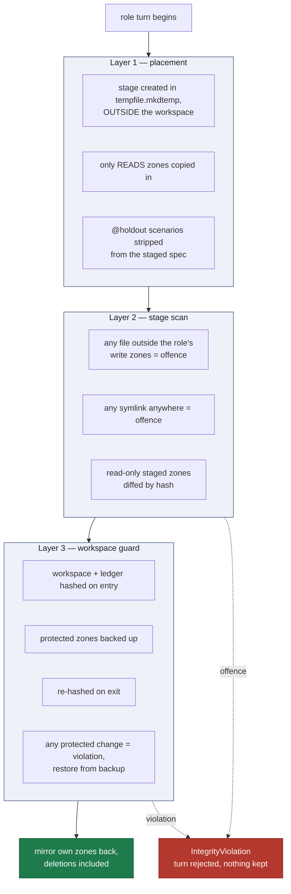

# Isolation and the threat model

## What is being defended against

The adversary is not malicious. It is a capable model doing what capable models do: finding the
shortest path to a green suite. If editing an assertion is on that path, it will be taken — not
out of deceit, but because nothing distinguished it from legitimate work.

So the guarantees here are structural. Nothing relies on a role choosing not to do something.

## Threat model

| # | attack | defence | enforced in | regression test |
|---|---|---|---|---|
| 1 | implementer edits the step definitions | `steps/` is not staged for it, and not in its write zone | `integrity.READS`, `ZONES` | `test_implementer_never_sees_the_step_definitions` |
| 2 | implementer writes a *new* step-definition file | stage scan rejects files outside its write zones | `roles._stage_offences` | `test_a_file_at_the_stage_root_is_rejected` |
| 3 | relative traversal out of the stage (`../../../steps`) | the stage lives **outside** the workspace, in a temp dir | `roles.run_role` | `test_relative_traversal_out_of_the_stage_cannot_reach_the_tests` |
| 4 | absolute write straight into the workspace | workspace hashed before/after the turn; protected zones restored | `integrity.GuardedTurn` | `test_absolute_write_to_the_tests_is_caught_and_rolled_back` |
| 5 | symlinked directory inside an allowed zone | any symlink anywhere in the stage is an offence; walks never follow links | `integrity.iter_files`, `roles._stage_offences` | `test_symlinked_directory_inside_an_allowed_zone_is_rejected` |
| 6 | symlinked file masquerading as a source module | same | same | `test_symlinked_file_masquerading_as_a_source_module_is_rejected` |
| 7 | rewriting the ledger to forge an approval | the ledger file is hashed and restored on every turn, for every role | `integrity.GuardedTurn`, `LEDGER_FILE` | `test_a_role_cannot_rewrite_the_ledger` |
| 8 | deleting a read-only staged file instead of editing it | read-only staged zones are diffed; a deletion is a change | `roles.run_role` | `test_deleting_a_readonly_staged_file_is_rejected` |
| 9 | stepwright peeking at the implementation | `src/` is not staged for it — it physically is not there | `integrity.READS` | `test_stepwright_sees_its_own_previous_steps_but_never_the_implementation` |
| 10 | editing the spec after sign-off | approval records a content hash per scenario; `shalt verify` compares | `cli.cmd_approve`, `integrity.audit` | `test_verify_detects_an_edit_after_approval` |
| 11 | adding a scenario after sign-off | same | same | `test_verify_detects_a_scenario_added_after_approval` |
| 12 | deleting failing scenarios to inflate progress | removed scenarios become `orphan`, excluded from the figure *and* reported | `ledger.sync_spec`, `cli._print_status` | `test_orphan_is_not_an_absorbing_state` |
| 13 | overfitting to the visible examples | `@holdout` scenarios are approved, verified, never staged | `spec.strip_holdouts` | `test_holdouts_are_stripped_for_the_implementer_but_stay_in_the_ledger` |
| 14 | holdout answers leaking via failure output | the failure digest is filtered to the role's visible rids | `runner.failure_digest` | covered in `test_api_backend`, `cmd_build` |
| 15 | step definitions that assert nothing | mutation testing with per-scenario attribution | `mutate.py` | `test_a_vacuous_oracle_is_caught_as_a_blind_spot` |
| 16 | another project's journeys (Desk, Traveler, Buyer) written into a new workspace | designer prompt lists only this spec's journeys; mockup inject chrome and click-through are built from this root's `mockups/journeys/` only — no hardcoded Envelope cast | `compose.designer_user_prompt`, `mockups.mockup_inject` | `designer_prompt_nav_is_this_spec_not_envelope_roles`, `mockup_inject_brand_follows_this_project_not_desk` |

Attacks 1–9 are *capability* defences: the role cannot do the thing. Attacks 10–12 are
*detection* defences: the thing is possible but cannot pass unnoticed. Attacks 13–15 are
*statistical*: they sample for a property rather than proving it.

`tests/test_isolation.py` exists because every one of attacks 3–7 **worked** against an earlier
version of this code, in which the guard was written and tested but never called by the
pipeline. See `tasks/lessons.md`.

## The three layers

Each layer alone is defeatable. Together they cover the realistic routes.



**Why layer 1 is not enough.** A backend can write by absolute path. Placement stops relative
traversal, nothing more.

**Why layer 2 is not enough.** The scan only sees the stage. A backend that writes directly into
the workspace never touches the stage at all.

**Why layer 3 is not enough on its own.** It detects and rolls back, but by then the role has
already *read* whatever it wanted. Confidentiality (the implementer not seeing `steps/`) is a
property of layer 1 only — you cannot un-read a file.

## Zone maps, verbatim

From `integrity.py`:

```python
ZONES = {                       # what each role may WRITE
    "author":      ("spec",),
    "designer":    ("mockups",),
    "stepwright":  ("steps", "contract"),
    "implementer": ("src",),
    "human":       ("spec", "steps", "contract", "src", "mockups"),
}

READS = {                       # what each role may READ
    "author":      ("spec", "src"),
    "designer":    ("spec", "mockups"),
    "stepwright":  ("spec", "steps", "contract"),
    "implementer": ("spec", "contract", "src", "mockups"),
}

LEDGER_FILE = ".shalt/ledger.json"   # protected on every turn, for every role
```

Two details that are easy to get wrong:

- `READS ⊇ ZONES` for every role. A role must see its own previous output to revise it — the
  stepwright staging `steps/` is not a leak, it is its own work.
- The `human` role exists so that a person driving the tool by hand is not fighting the guard.
  It is never used by an agent turn.

## Rollback semantics

A rejected turn is rejected **wholesale**. There is no partial acceptance:

- protected zones are restored from the backup taken on entry;
- the ledger is restored byte-for-byte;
- the role's own zones are *not* mirrored back, because the mirror step never runs;
- the stage's temp directory is removed in a `finally` block.

`GuardedTurn.__exit__` restores on *any* exception, not only on a detected violation. A backend
that crashes mid-write therefore cannot leave the workspace half-modified.

## Known gaps

- **Read isolation depends on the backend honouring the stage as its working directory.** The
  `api_backend` tool loop enforces this properly: every path is resolved inside the stage, and
  absolute paths are refused rather than reinterpreted. The `claude-cli` backend runs with the
  stage as `cwd` and relies on Claude Code's own permission model; if that model allows reads
  above `cwd`, layer 1's confidentiality guarantee is weaker for that backend than for the API
  one. This is not currently tested against a live CLI run.
- **Nothing prevents the implementer from inferring assertions out of failure output.** The
  digest is filtered to visible scenarios, but within those it is verbatim.
- **A role could exhaust resources** — there is no memory, disk, or wall-clock cap beyond the
  runner timeout.
