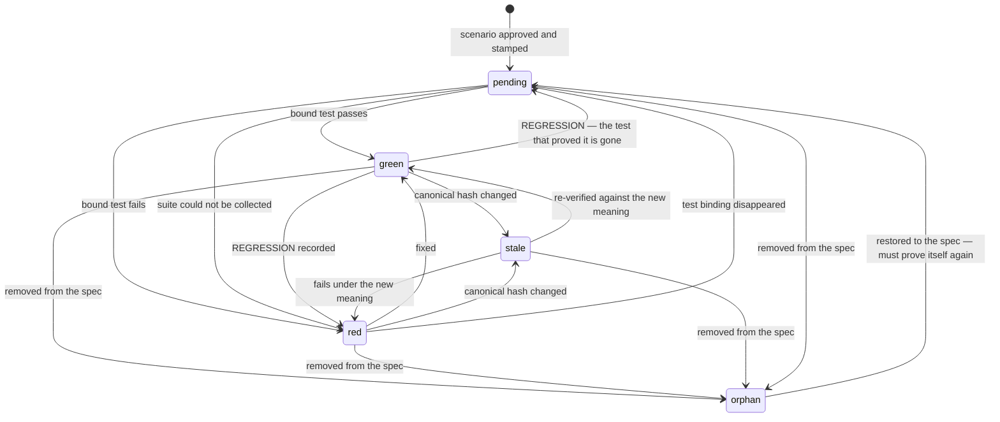

# The scenario ledger

`.shalt/ledger.json` is one artifact that is simultaneously the requirement, the test binding,
the ticket and the progress bar. It is deliberately a portable, versioned JSON document rather
than a database, and it is tied to no runner and no vendor.

Schema: `shalt.ledger/1`.

## Status state machine



| status | display | meaning |
|---|---|---|
| `pending` | no test | approved, but no test is bound to it. **Never counted as upheld.** |
| `red` | failing | a bound test exists and fails |
| `green` | upheld | a bound test passes against the scenario's current meaning |
| `stale` | stale | was upheld; the meaning has since changed; needs re-verification |
| `orphan` | removed | a ledger entry whose scenario has left the spec |

## The invariants

These are the properties that make the numbers mean something. Each has a test.

**1. Absence of evidence never rounds toward success.** A scenario with no bound test is
`pending`, never `green`. `completion_pct` counts only `green`.
→ `test_a_scenario_with_no_test_is_pending_never_green`

**2. Upheld is relative to a hash.** Change what a scenario means and the status expires.
→ `test_green_goes_stale_when_its_scenario_changes_meaning`

**3. A parent is never greener than its children.** Roll-up returns the worst child status;
`green` requires *every* child green.
→ `test_a_parent_is_never_greener_than_its_children`

**4. Every downgrade from upheld is recorded as a regression**, including the subtle one where
the test simply disappears. An earlier version silently downgraded that case to `pending`.
→ `test_losing_the_test_that_proved_a_scenario_is_a_regression`

**5. `orphan` is not an absorbing state.** Delete a scenario, run any command, restore it
verbatim — it returns as `pending` and must prove itself again. Before this fix, a deleted-then-
restored scenario stayed invisible and unfailable forever while the ledger showed 100%.
→ `test_orphan_is_not_an_absorbing_state`

**6. A blocked suite is red, not pending.** If the suite could not be collected, we know only
that it did not run — not that no test is bound. Claiming `pending` would misreport a broken
harness as ordinary unfinished work.
→ `test_blocked_suite_reports_red_not_pending`

**7. Deleting failing scenarios does not silently inflate progress.** Removed scenarios leave
the denominator but are reported explicitly by `status` and by `verify`.

**8. The format tolerates unknown fields**, so a future version or an external tool can add keys
without breaking readers.
→ `test_ledger_tolerates_unknown_fields`

## Schema reference

```json
{
  "schema": "shalt.ledger/1",
  "generated_at": "2026-09-12T19:17:35Z",

  "summary": {
    "green": 13, "red": 1, "pending": 0, "stale": 0, "orphan": 0,
    "total": 14, "completion_pct": 92.9
  },

  "spec_lock": {
    "approved_by": "dan@rivlet.io",
    "approved_at": "2026-09-12T15:44:20Z",
    "scenario_count": 14,
    "files": { "invoice.feature": 5 },
    "scenario_hashes": { "S-b291b8fd": "sha256:7f273b59..." }
  },

  "regressions": [
    { "at": "...", "rid": "S-d64f4179", "name": "Two months late gets a final demand",
      "run": "run-20260912-191735", "detail": "assert 'firm' == 'final'" }
  ],

  "mutation": {
    "score": 87.5, "killed": 21, "survived": 3, "invalid": 0,
    "baseline_green": 14,
    "kills":        { "S-b291b8fd": 6 },
    "vacuous":      [],
    "weak_oracles": { "S-0a540700": "ran 1 mutated version(s) of code it executes without noticing" },
    "blind_spots":  { "S-0a540700": ["src/currency.py:5  string  'USD' -> 'shalt-mutant'"] },
    "survivors":    ["src/currency.py:5  string  'USD' -> 'shalt-mutant'"]
  },

  "scenarios": {
    "S-0a540700": {
      "rid": "S-0a540700",
      "name": "Yen has no minor unit",
      "feature": "Currency presentation",
      "feature_file": "currency.feature",
      "tags": ["@rid:S-0a540700", "@epic:billing"],

      "epic": "billing",
      "actor": "billing clerk",
      "capability": "amounts shown in the customer's own currency",
      "benefit": "an invoice is never misread as the wrong figure",

      "status": "green",
      "spec_hash":          "sha256:7f273b590236781891b588192789a900",
      "verified_spec_hash": "sha256:7f273b590236781891b588192789a900",
      "last_green_at": "2026-09-12T19:17:35Z",
      "last_run_at":   "2026-09-12T19:17:35Z",
      "failure": "",

      "mutants_killed": 6,
      "blind_spots": 1,

      "history": [
        { "at": "2026-09-12T19:15:16Z", "event": "added", "spec_hash": "sha256:7f27..." }
      ]
    }
  }
}
```

### Field notes

| field | notes |
|---|---|
| `spec_hash` | the scenario's current canonical hash, recomputed on every command |
| `verified_spec_hash` | the hash it was last `green` against; cleared on any downgrade |
| `epic`, `actor`, `capability`, `benefit` | denormalised from the spec so the dashboard and tree need no second source of truth |
| `mutants_killed` | `null` until `shalt mutate` has run; `0` means **vacuous** |
| `blind_spots` | survivors in files this scenario provably executes; `> 0` means a weak oracle |
| `history` | append-only, capped at the last 50 events per scenario |
| `regressions` | never truncated — the permanent record of every downgrade from upheld |

### History event types

`added`, `spec_changed`, `fixed`, `restored_to_spec`, `removed_from_spec`, `test_unbound`,
`REGRESSION`, `VACUOUS`, `BLIND_SPOT`. Upper-case events are the ones worth alerting on.

## Concurrency and durability

There is none. The ledger is read, mutated in memory and rewritten whole by a single process.
Two `shalt` commands run concurrently against one workspace will lose one set of writes. For a
single developer or a serialised CI job this is fine; a multi-writer deployment would need
either file locking or a real store behind the same schema.
