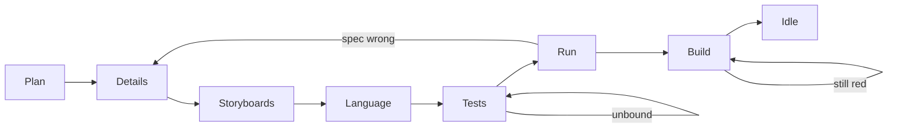
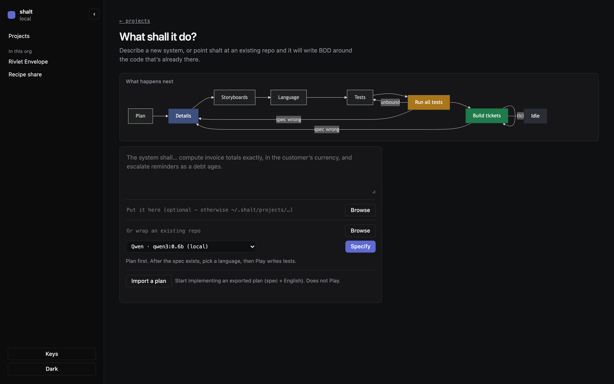
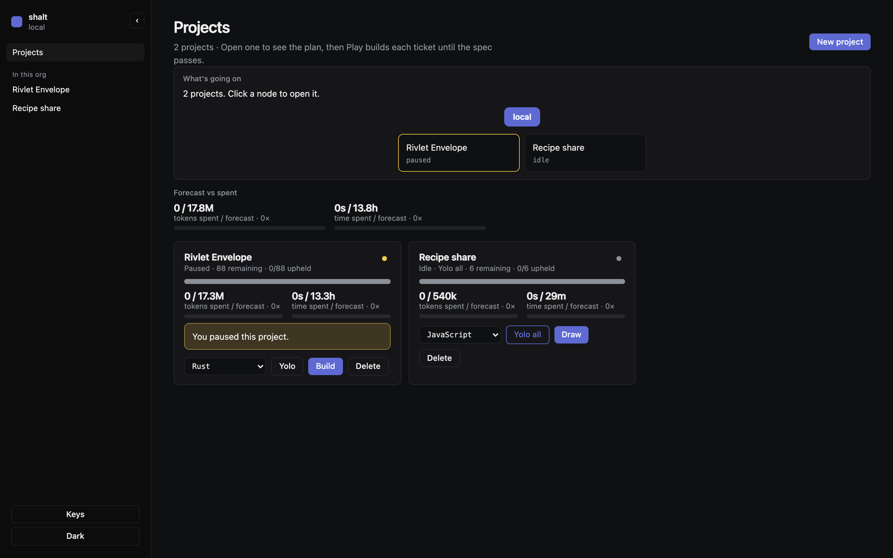
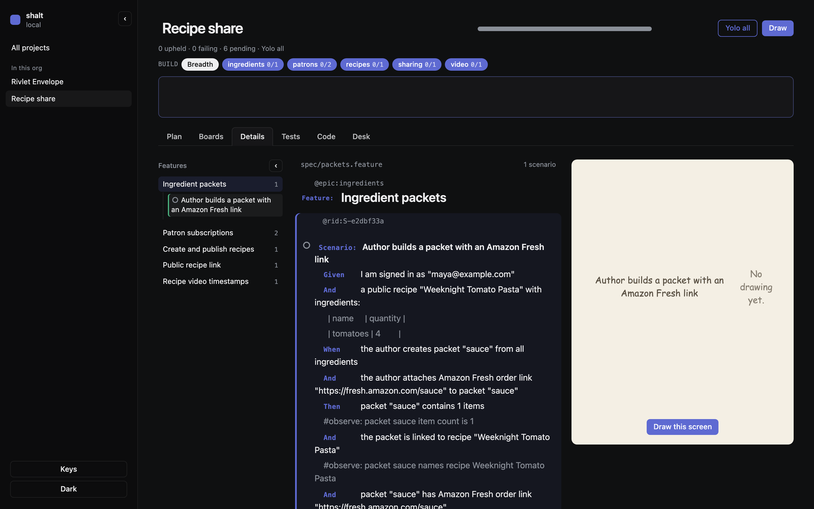
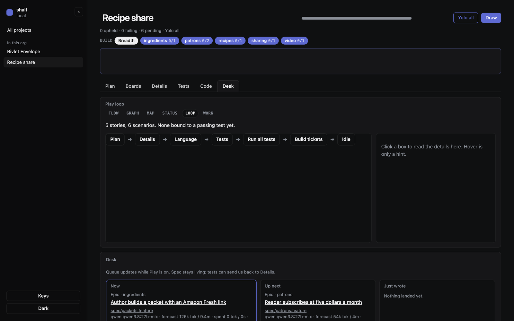
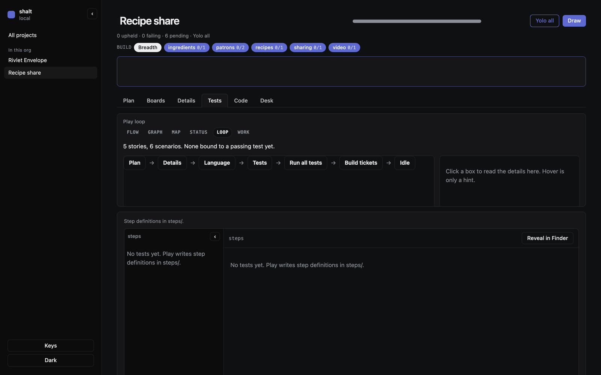
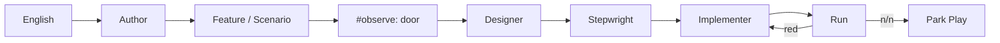
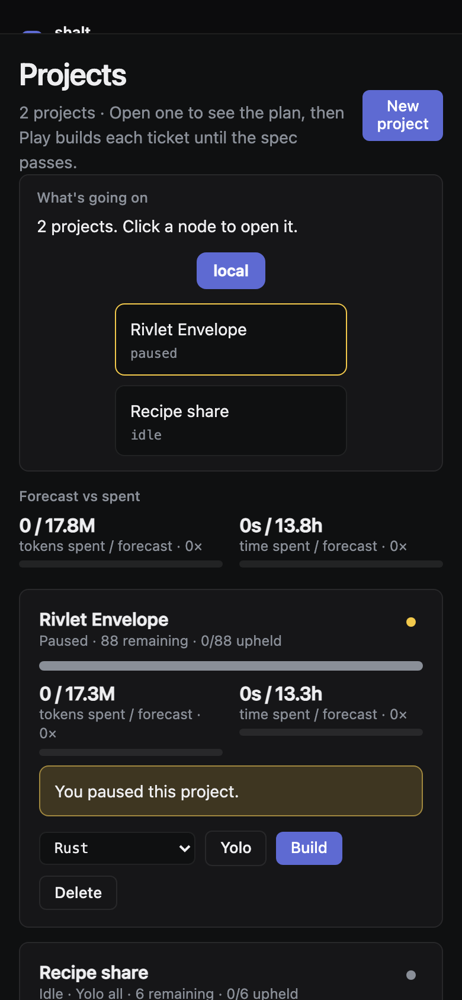

# Manual

How to run the desk. Architecture and threat model live in the other docs.

## Install

```bash
cargo install --path crates/shalt --force
shalt --help
shalt ui
```

Opens `http://127.0.0.1:7700/` (next free port in 7700–7799 if that one is taken). One desk. `shalt ui restart` after you rebuild. `shalt stop` parks jobs and kills the desk.

Cloud keys go in **Keys** (sidebar) → `~/.shalt/config.toml`. They are never printed. Env vars win if set.

macOS app: `./scripts/macos-install.sh` — same engine in a window.

## The loop



English → Feature/Scenario spec → storyboards → pick a language → bound tests → run → implement until n/n. Play **parks** when every scenario is green. Sitting idle with Play still on was a bug.



*New project. Specify writes the spec. Play is a later, separate act.*

## Inbox

`shalt org add PATH` registers a git workspace. The home screen is the catalog. One project plays at a time.



*Two local projects. Envelope is paused on purpose. Recipe share is a fixture for the write pool — not this repo.*

Play / Pause / Yolo / language live on the card. Forecast vs spent is measured tokens and time, not a human estimate.

## Spec

Every scenario needs a `@rid:` (stamped at approve) and every Then needs `#observe:` — the door, locked before Play.

```
  @rid:S-e2dbf33a
  Scenario: Author builds a packet with an Amazon Fresh link
    When the author creates packet "sauce" from all ingredients
    Then packet "sauce" contains 1 items
    #observe: packet sauce item count is 1
```

Changing the Then or the observe line after Play is an amendment. Review is the **sentences plus the Then bodies**. Details shows both. `shalt verify` flags a Then that acts (does the When, `assert.ok(this.…)`, `||` always-true).



*Details. Feature rail, scenario with `#observe:`, sketch pane. Titles-only is taking the spec's word.*

## Play

```
shalt org yolo ID all    # take guesses — a setting, not a virtue
shalt org play ID
shalt org pause ID
```

Same buttons on the desk. Yolo all still has to guess something concrete; empty and “reasonable assumption” are refused.



*Desk tab. Plan → Details → Language → Tests → Run → Build → Idle. Now / Up next / Just wrote.*

When the board is n/n, Play parks: `Done — n/n scenarios are green`. Greens that never went red are called out.

## Tests and code

Stepwright writes `steps/` + `contract/` and cannot see `src/`. Implementer writes `src/` and cannot see step defs. A turn that writes outside its zone is rolled back.

```
shalt run
shalt status
shalt verify
shalt tree
```



*Tests tab. Bound files, or pending. Pending is not green.*

## Diagrams

`shalt diagrams` writes Mermaid under `docs/diagrams/` from the spec and ledger — use-cases, breakdown, pipeline. Derived, not drawn. They cannot drift from the spec unless you stop generating them.



## Phone



Same catalog. Keys stay in the sidebar — don't paste them into tickets.

## If it sits there

| You see | Usually |
|---|---|
| Play on, 0 workers, not n/n | loop bug; `shalt verify` / jobs |
| Author looping markdown | spec has no `Scenario:`; `#` headings are refused |
| Then green, never red | distrust it |
| Extra `shalt ui` on 7701 | one desk; extra ports are refused while 7700 is up |
| Envelope / some other project started | Pause it. One Play at a time. |
