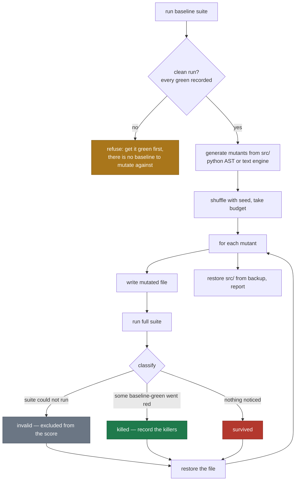

# Mutation-testing the oracle

The write guard stops an implementer tampering with the tests. Holdouts catch an implementer
overfitting to the examples it saw. Neither says anything about the **stepwright** — nothing
elsewhere in the system checks that the generated step definitions actually assert what their
scenario claims. A step definition ending in `assert result is not None` passes every time, and
the ledger shows green.

## The direction of the check

The check runs the opposite way to the obvious one. Rather than mutating the step definitions,
`shalt mutate` mutates the **implementation** and asks whether the scenarios notice.

Break the rounding rule; if "a half-cent total rounds up" stays green, that scenario is not
testing rounding, whatever its name says.

Every mutant records **which scenarios went red**, so each scenario gets its own oracle-strength
count rather than one suite-wide score.

## The campaign



The whole of `src/` is copied to a temp directory before the campaign and restored from it in a
`finally` block, so an interrupted run cannot leave a mutation behind.

## Two signals, and why neither is sufficient alone

This is the part that took a correction. The first implementation defined a weak oracle as
**"a green scenario that killed zero mutants."** It then cleared a step definition whose entire
assertion was `assert result is not None`.

The reason: **a vacuous assertion still catches mutations that make the code crash.**
`Decimal('shalt-mutant')` raises, the step blows up, the scenario goes red — so a meaningless
assertion posts a healthy kill count. What it cannot catch is a *well-formed wrong value*.

So there are two signals:

| signal | definition | catches |
|---|---|---|
| **vacuous** | a baseline-green scenario that killed **nothing** | an oracle so weak that even crashes pass |
| **blind spot** | a survivor in a file the scenario **provably executes** | an oracle with a good kill count that still ignored a wrong value |

And they are **mutually exclusive by construction**: a vacuous scenario has no kills, so there is
no evidence of which files it runs, so it can never be attributed a blind spot. Which signal
fires depends on whether the sampled mutations happen to crash or merely change a value — so
callers check the **union**, `MutationReport.weak_oracles`.
→ `test_the_two_signals_are_complementary_and_the_union_is_what_callers_check`,
`test_a_healthy_kill_count_does_not_clear_a_blind_spot`

## Attribution without a coverage tool

Blind-spot attribution needs to know which files a scenario executes. Rather than adding a
language-specific coverage dependency, it is **derived from the kills**:

> If a scenario went red when file `F` was mutated, that scenario provably executes `F`.

```python
exercised[rid] = {m.path for m in killed if rid in m.killed_by}
blind_spots[rid] = [m for m in survived if m.path in exercised[rid]]
```

This is coverage-like attribution for free, in any language, from data the campaign already
collects. Its limit is the same as its mechanism: a scenario with no kills gets no attribution,
which is exactly why the `vacuous` signal has to exist alongside it.

## A blind spot is one of two defects

They need different fixes, and the tool **cannot tell them apart** because it does not know
which inputs each scenario uses:

- **the assertion does not check the value** → the step definitions are weak;
- **no scenario exercises the case the mutation changes** → the spec is missing a scenario,
  usually a boundary the narrative implies but no example pins down.

Both are real defects in the spec/test pair, so both are surfaced, and the report says so rather
than guessing.

Worked example, from the project's own worked example — a spec written by hand and believed
complete. Three genuine gaps:

| survivor | what it revealed |
|---|---|
| `MINOR_UNITS` key `'USD'` → sentinel | the entry is masked by the `.get(code, 2)` default; it is redundant |
| `.get(code, 2)` default `2` → `3` | no scenario uses an unsupported currency code |
| `Decimal(1).scaleb(-places)` `1` → `2` | no scenario uses an odd cent, so the quantum is untested |
| `THRESHOLDS` `1` → `2` | no scenario tests exactly 1 day overdue, though the contract specifies it |

## Operators

### Python AST engine (`--engine python`)

| operator | mutation |
|---|---|
| `comparison` | `==`↔`!=`, `<`↔`>=`, `>`↔`<=` |
| `arithmetic` | `+`↔`-`, `*`↔`/` |
| `boolean` | `and`↔`or` |
| `boolean-literal` | `True`↔`False` |
| `number` | `n` → `n + 1` (int and float) |
| `string` | `s` → `"shalt-mutant"` |

Each mutant is produced by re-parsing the source, selecting the *n*th eligible node, transforming
it and `ast.unparse`ing the tree. A rewrite that produces identical output is discarded rather
than counted.

**Docstrings are never mutated.** A mutated docstring always survives, so including them filled
the survivor list with findings nobody can act on — in one run, five of six entries. A survivor
list you learn to ignore is worse than no survivor list.
→ `test_docstrings_are_never_mutated`

### Text engine (`--engine text`)

Deliberately crude and deliberately language-agnostic; works on `.py .js .mjs .ts .go .java .rb
.cs .kt .rs`. Regex operators on single lines for comparisons, `&&`/`||`, `and`/`or`,
`true`/`false` in both cases, and `+`/`-`. Lines whose first non-space characters are `#`, `//`,
`--`, `*` or `/*` are skipped as comments.
→ `test_text_engine_works_on_a_language_with_no_python_ast`,
`test_text_engine_ignores_files_it_cannot_reason_about`

`--engine auto` (the default) picks `python` for a Python stack and `text` otherwise.

## Invalid mutants

A mutation that breaks the suite itself — a syntax error, an import failure — is classified
`invalid` and **excluded from the score entirely**, neither killed nor survived. It proves
nothing about the assertions, and counting it either way would distort the number.

## Compiled languages: the stale-binary hazard

Mutating an interpreted language is straightforward — the next run reads the file. For anything
that compiles, the build system sits between the mutation and the test, and it can silently
decline to notice.

The campaign restores `src/` at the end with `shutil.copytree`, which **preserves mtimes**. A
restored source then looks *older* than artifacts compiled from a mutant, so cargo, `go build`,
`javac` and the rest skip the rebuild. The next campaign's **baseline** therefore runs a binary
built from the previous campaign's last mutant: scenarios fail at baseline that should pass, they
drop out of `baseline_green`, and mutants affecting them can no longer be killed — so they are
reported as survivors.

Found by running shalt against a real Rust project, where identical input produced **100%, then
25%, then 25%**.

Three defences, because the first one alone is a fix and the other two are how you find out it
stopped working:

1. **`_touch_tree`** stamps every restored file as modified now, so any mtime-based build system
   rebuilds.
2. **The campaign re-runs the baseline afterwards.** If the restored workspace no longer
   reproduces it, the report carries an error instead of a score. A number measured against the
   wrong binary is worse than no number.
3. **A run that reports nothing about any measured scenario is `invalid`, not `survived`.**
   Silence is not evidence of survival — and cucumber-rs exits `0` even when scenarios fail, so
   a missing report can otherwise look like a clean pass.

A practical consequence: mutation testing a compiled project costs a full rebuild per mutant.
On the small Rust example that is about 0.7s; on a real codebase it is the difference between a
nightly job and an overnight one.

## Limitations, which bound what a score means

1. **Equivalent mutants.** Some mutations do not change behaviour at all: an unreachable branch,
   a value never read, a default that equals the entry it shadows. Those survive for reasons
   unrelated to the oracle. **A survivor is a question, not a proven defect.**
2. **Coverage confounds strength.** A mutant on a line no scenario reaches survives because
   nothing runs it. Survivors are always reported with file and line so a human keeps that
   distinction.
3. **It is sampled, not exhaustive.** `--budget` mutants are drawn from a seeded shuffle. A
   small budget can miss the finding entirely — the project's own demo initially ran at budget
   12, drew only crash-mutants, reported a clean 100% and proved nothing.
4. **It is slow.** One full suite run per mutant. Budget 30 against a 14-scenario suite is about
   a minute; against a real suite it is a nightly job, not a pre-commit hook.
5. **Nothing checks the stepwright's *interface* choices** — only its assertions. A contract that
   declares the wrong surface will be satisfied faithfully and wrongly.

## Ledger integration

`ledger.apply_mutation` writes `mutants_killed` and `blind_spots` onto each baseline-green
scenario and records a `VACUOUS` or `BLIND_SPOT` history event. `shalt verify` then reports both
as integrity problems, and the dashboard shows an `n×` kill count plus a `vacuous` or
`weak oracle` chip — so a scenario that is green but tests nothing is visible rather than
inferred.

`shalt mutate` exits `1` when any weak oracle is found, `0` when none is, so it can gate CI.
