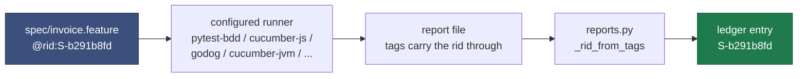

# Language agnosticism

The zone model, scenario identity, the ledger, the guards and the mutation-testing attribution
are all language-neutral. The only language-specific part was ever the test runner, so that part
lives in configuration.

## Why binding works without per-language code

`@rid:` is a Gherkin **tag**. Tags survive into every report format in the Cucumber family. So
the id travels with the scenario all the way into the test output, and mapping a result back to
a ledger entry needs no filename matching, no name matching, and no per-language shim.



**Tag spelling is not portable, and the format does not settle it.** cucumber-rs emits
`{"name": "rid:S-0d41bae1"}` — with **no leading `@`** — while cucumber-jvm and cucumber-js keep
it. `reports._rid_from_tags` therefore normalises the tag before matching.

This is worth dwelling on because of how it failed. shalt's parser originally matched only
`@rid:`, so against a real Rust project it bound *nothing*: every scenario reported `pending`,
which reads as ordinary unfinished work rather than a bug. There was no error, no warning, and
the synthetic test payload — written by the same person as the parser — had the `@`. Only a real
runner could have found it. Regression test:
`test_a_tag_without_the_leading_at_sign_still_binds`, using output captured verbatim from
cucumber-rs.

An earlier version keyed on `(feature file basename, scenario name)`. That collided whenever two
features in different directories shared a basename and a scenario name — one rid received both
outcomes, the other was permanently `pending` despite having a passing test. Binding by tag
removed the whole class of bug.
→ `test_same_basename_in_different_directories_does_not_collide`

## Configuration

`shalt.toml`, written by `shalt init --stack <name>`:

```toml
[project]
name  = "Invoicing"
stack = "rust"

[zones]
steps = "steps"          # step definitions; written by the stepwright only
src   = "src"            # implementation; written by the implementer only

[runner]
command = "npx cucumber-js {spec} --require {steps} --format message:{report}"
format  = "cucumber-messages"     # shalt | cucumber-json | cucumber-messages
report  = ".shalt/messages.ndjson"
timeout = 900
```

### `[runner].command` placeholders

| placeholder | expands to |
|---|---|
| `{spec}` | absolute path to `spec/` |
| `{steps}` | absolute path to the configured steps zone |
| `{src}` | absolute path to the configured src zone |
| `{report}` | absolute path the runner must write its report to |
| `{root}` | the workspace root |

A command containing `|`, `>` or `&&` is run through a shell (`Config.uses_shell`); otherwise it
is `shlex.split` and executed directly. `PYTHONPATH` is extended with the workspace root and the
src zone, and `[runner].env` entries are merged into the environment.

### `[runner].env`

Values here take the **same placeholders as the command**. Some runners have no flag for the
report path — `cargo test` is the obvious one — so an environment variable is the only channel:

```toml
[runner.env]
SHALT_REPORT = "{report}"
```

Without substitution the path would have to be hardcoded identically in `shalt.toml` and in the
test binary. Two places that must agree, with nothing forcing them to, is a drift waiting to
happen.

### `[runner].format`

| format | produced by | parser |
|---|---|---|
| `shalt` | shalt's own pytest plugin | `reports.parse_native` |
| `cucumber-json` | cucumber-js, cucumber-jvm, godog, behave, Reqnroll | `reports.parse_cucumber_json` |
| `cucumber-messages` | cucumber-js `--format message` and other modern Cucumbers | `reports.parse_cucumber_messages` |

An unknown format is rejected at load time rather than silently treated as empty results.
→ `test_an_unknown_report_format_is_rejected`

## Stack presets

Gherkin + `@rid:` + a Cucumber-family report is how *any* language runs. **Rust and JavaScript
are supported.** Next: python. The rest should still run if the toolchain is present.

`shalt init --stack rust` (default) or `--stack javascript`. `--stack python|go|java|ruby|dotnet`
writes a preset and a note; it does not refuse.

| stack | support | runner | format | default zones |
|---|---|---|---|---|
| `rust` | **supported** | `cargo test --test shalt` (cucumber crate as the Gherkin runner) | `cucumber-json` | `tests/`, `src/` |
| `javascript` | **supported** | `npx cucumber-js --import {steps}/**/*.js --format message:{report}` | `cucumber-messages` | `steps/`, `src/` |
| `python` | later | `pytest` + `pytest-bdd` + workspace reporter | `shalt` | `steps/`, `src/` |
| `go` | later | `godog run --format=cucumber > {report}` | `cucumber-json` | `features/`, `internal/` |
| `java` | later | `mvn test -Dcucumber.plugin=json:{report}` | `cucumber-json` | `src/test/java`, `src/main/java` |
| `ruby` | later | `bundle exec cucumber --format json --out {report}` | `cucumber-json` | `features/step_definitions`, `lib/` |
| `dotnet` | later | `dotnet test` + Reqnroll Cucumber output | `cucumber-json` | `Tests/`, `src/` |

The Rust preset is exercised against a real toolchain — see `examples/rust-billing/`. Its zones
map onto Cargo's own layout. JavaScript uses cucumber-js ESM under `steps/` and `src/`.

Every preset is asserted to load and to substitute all placeholders.
→ `test_every_preset_writes_a_loadable_config`, `test_config_substitutes_workspace_paths`

## The pass rule

A scenario is `passed` **only if every one of its steps passed.** Skipped, pending, undefined and
ambiguous all count as not-passed.

This is not pedantry. A step nobody implemented is not evidence of success, and Cucumber runners
report undefined steps while still exiting cleanly in some configurations — so without this rule
a suite full of unimplemented steps reads as green.
→ `test_cucumber_json_binds_by_rid_tag_and_undefined_is_not_green`,
`test_cucumber_messages_walks_the_envelope_stream`

Scenario Outlines produce one result per example row. The scenario is upheld only if **all** rows
pass; a single failing row fails the scenario.
→ `test_cucumber_json_outline_is_green_only_if_every_row_passes`

## How Cucumber Messages is parsed

The NDJSON envelope stream is walked and four relations assembled:

```
pickle.id        → rid           (from pickle.tags)
testCase.id      → pickleId
testCaseStarted  → testCaseId
testStepFinished → testCaseStartedId + status
```

Statuses are then aggregated per `testCaseStartedId`, mapped back through the chain to an rid.
Envelopes that fail to parse are skipped rather than aborting the read.

## Adding a stack

1. Make the runner emit Cucumber JSON or Cucumber Messages to a path you control.
2. Add a `Preset` to `config.PRESETS` with the command, format, report path and zone names.
3. Nothing else. No parser, no binding code, no ledger change.

If the runner emits neither format, write a parser returning
`{rid: {"outcome": "passed"|"failed", "detail": str, "nodeid": str}}` and register it in
`reports.PARSERS`. That is the entire contract — about 30 lines for the Cucumber JSON case.

## Harness errors versus red scenarios

A distinction worth preserving, because conflating them misreports a broken setup as unfinished
work:

| condition | treated as | rationale |
|---|---|---|
| exit 3 or 4 (internal error, bad usage) | `harness_error` — abort loudly | ours to fix |
| exit 2 (interrupted, usually a collection error) | `collection_error` — feed to the implementer | typically "the implementation does not exist yet" |
| no results and non-zero exit | `collection_error` | same |
| runner binary not found | `harness_error`, naming `shalt.toml` | a configuration mistake |
| timeout | `harness_error`, naming the timeout | a configuration or runaway-build mistake |
